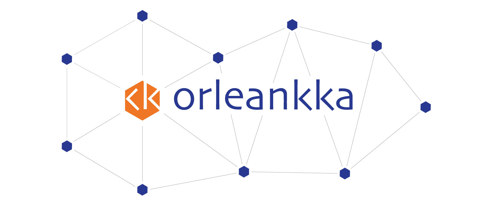

Orleankka is a functional extension for Microsoft Orleans framework. It provides a message-based API similar to Akka/ProtoActor, carefully layered on top of the Orleans (that's what in a name). Orleankka is an excellent choice for use-cases which can benefit from composable, uniform communication interface, such as CQRS, event-sourcing, FSM, etc.

> References: [intro](https://www.youtube.com/watch?v=07Up88bpl20), [features](https://www.youtube.com/watch?v=FKL-PS8Q9ac), [slides](https://docs.google.com/presentation/d/1brM4SS-uJBRMZs-CdOZoJ0KUgrnPXXwrOXnYgfLL4Nk/edit#slide=id.p4) and [discussion](https://github.com/dotnet/orleans/issues/42).

## Terms of use

By using this project or its source code, for any purpose and in any shape or form, you grant your **implicit agreement** to all the following statements:

- You **condemn Russia and its military aggression against Ukraine**
- You **recognize that Russia is an occupant that unlawfully invaded a sovereign state**
- You **support Ukraine's territorial integrity, including its claims over temporarily occupied territories of Crimea and Donbas**
- You **reject false narratives perpetuated by Russian state propaganda**

To learn more about the war and how you can help, [click here](https://github.com/yevhen/yevhen). Glory to Ukraine! 🇺🇦

### Features

+ Message-based API with zero performance overhead
+ Switchable actor behaviors with built-in hierarchical FSM (behaviors)
+ Additional api to simplify programming long-running background tasks (jobs)
+ Poweful actor/proxy middlewares (interceptors)
+ Convenient unit testing kit (stubs, mocks, expectations)

### How to install

To install client Orleankka library via NuGet, run this command in NuGet package manager console:

	PM> Install-Package Orleankka.Client

For server-side library:

	PM> Install-Package Orleankka.Runtime

Check out "Getting started" [guide](http://orleanscontrib.github.io/Orleankka/articles/intro/getting-started-csharp.html)

### Build sources

You will need VS2019 and .NET Core 3.x installed in order to build and open the solution. Clone repository and run the following in CLI from solution's root folder:

	PM> Nake.bat

This will restore dependencies and build everything in `debug` mode. Run `Nake.bat` with `-T` switch to see available commands.

On MacOS\Linux distributions use below script to build, package or run tests:

	$> ./nake.sh

### Packages

| Package | Description|
| ------- |------------|
| [Orleankka](https://www.nuget.org/packages/Orleankka) | Core abstractions lib
| [Orleankka.Client](https://www.nuget.org/packages/Orleankka.Client) | Client-side lib
| [Orleankka.Runtime](https://www.nuget.org/packages/Orleankka.Runtime/) | Server-side runtime lib
| [Orleankka.TestKit](https://www.nuget.org/packages/Orleankka.TestKit/) | Unit testing kit

### Examples

+ Hello, world! [[demo]](Samples/CSharp/HelloWorld)
+ "WebScan" [[demo]](Samples/CSharp/Demo/Demo.App)
+ TestKit [[demo]](Source/CSharp/Demo/Demo.App.Tests)
+ Event Sourcing 
	+ Idiomatic (CQRS) [[see]](Samples/CSharp/EventSourcing/Idiomatic)
	+ Persistence: GetEventStore [[see]](Samples/CSharp/EventSourcing/Persistence/GES)
	+ Persistence: Streamstone [[see]](Samples/CSharp/EventSourcing/Persistence/Streamstone)
+ Reentrant messages [[rw-x]](Samples/CSharp/Reentrant)
+ Client-side observers [[chat]](Samples/CSharp/Observers)
+ Streams [[chat]](Samples/CSharp/Streams)
+ Switchable behaviors
	+ Basics [[see]](Samples/CSharp/FSM/Lightbulb)
	+ Durable FSM with supervision[[see]](Samples/CSharp/FSM/ProcessManager)

### Documentation

At present, documentation is undergoing a major overhaul. Please, check the unit tests and examples above to get up-to-date information on API usage.

## Community

+ Join [Gitter](https://gitter.im/OrleansContrib/Orleankka) chat
+ Follow the [@Orleankka](https://twitter.com/Orleankka) Twitter account for announcements

## License

Apache 2 License
